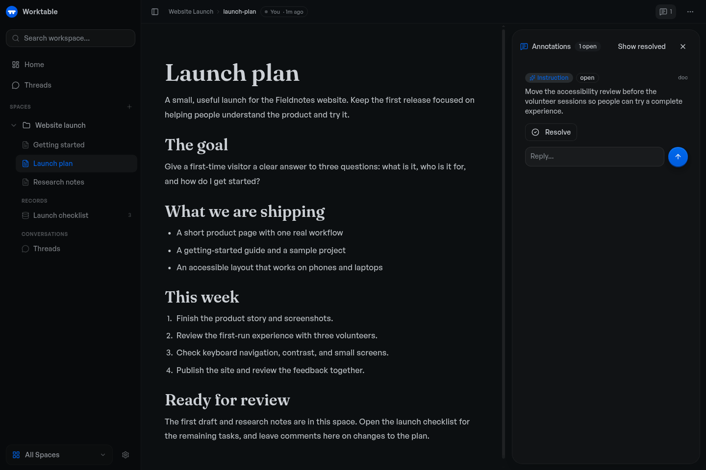

# Worktable

**Bring your work and agents together.**

Worktable is an open-source workspace where your agents save research, organize
data, and build interactive tools. Connect them through MCP, then open their
work in your browser to view, edit, or leave feedback whenever you need to.

Run it locally with files you control, self-host it, or use Worktable Cloud.

[Get started](#get-started) · [Documentation](https://docs.worktable.dev) · [Worktable Cloud](https://www.worktable.cloud) · [Releases](https://github.com/worktable/worktable-dev/releases)



*An agent-built cost explorer, backed by saved research and workspace records.*

## Get started

Use an MCP-compatible agent, with its own subscription or API credentials
where required.

**macOS app:** [Download Worktable for Mac](https://github.com/worktable/worktable-dev/releases/latest/download/worktable-desktop-darwin-arm64.dmg)
for Apple Silicon, macOS 13 or newer. Install and open the app, then choose **This Mac**.

**Terminal:** macOS or Linux, arm64 or x64. No separate runtime or source
checkout needed.

```sh
curl -fsSL https://worktable.dev/install | sh
```

Open the browser address printed by the installer. Run `worktable` to open
it again later.

In either version, open **Settings → Agents** and [connect your agent](https://docs.worktable.dev/start/connect-your-agent/).
Ask it to save research, organize records, or build a tool in Worktable.

[Inspect the installer](install.sh) · [Installation guide](https://docs.worktable.dev/start/install/) · [Your first space](https://docs.worktable.dev/start/first-space/)

**Cloud:** [Worktable Cloud](https://www.worktable.cloud) manages hosting for you.
For other setups, see [self-hosting](https://docs.worktable.dev/guides/remote-access/).

## Durable artifacts for all kinds of work

- **Save your research.** Keep findings, plans, and decisions in linked documents.
- **Organize your data.** Maintain tasks, sources, feedback, and other records
  with shared fields.
- **Build tools in Worktable.** Ask for an interactive dashboard, board, or calculator.
  HTML tools can read and update the same records your agents maintain.

For example, ask an agent to research hosting options, save the sources and
pricing, and build a cost explorer for your expected usage. Recheck the rates
or change the assumptions later; the research, data, and tool stay together.

## Start in one agent. Continue in another.

Connected agents work with the same saved documents, records, and tools. Ask
another agent to continue from what's already there. You can edit the results
yourself or leave comments for an agent to act on.

## Your workspace is yours

- **Keep work local.** Local and self-hosted workspaces are backed by files you
  can inspect and back up. Local Worktable requires no account.
- **Move your workspace.** [Export and import](https://docs.worktable.dev/guides/import-export/)
  between Local, self-hosted Worktable, and Cloud.

Connected agent providers may process the content you give them under their own
terms. See the [file-backed foundation](https://docs.worktable.dev/concepts/file-based-foundation/)
for storage and portability details.

## Documentation and help

[Use cases](https://docs.worktable.dev/guides/what-to-use-it-for/) · [CLI and MCP reference](https://docs.worktable.dev/reference/cli/) · [Changelog](CHANGELOG.md)

[Report a bug](https://github.com/worktable/worktable-dev/issues/new?template=bug_report.yml)
or [ask a question](https://github.com/worktable/worktable-dev/discussions/categories/q-a).
Remove private information from attachments. Report vulnerabilities privately
through the [security policy](SECURITY.md).

## Contributing

Fixes and documentation improvements are welcome. Please discuss substantial
features first. Read [CONTRIBUTING.md](CONTRIBUTING.md) for the contribution process,
[development](docs/development.md) to run from source, or
[building](docs/building.md) to create release artifacts.

## License

The Worktable application is **AGPL-3.0-only**, copyright Reva Labs.
See [LICENSE](LICENSE). Some shared components and agent plugins have MIT
licenses; [NOTICE](NOTICE) and the relevant package notices identify the exact
exceptions and third-party terms.
