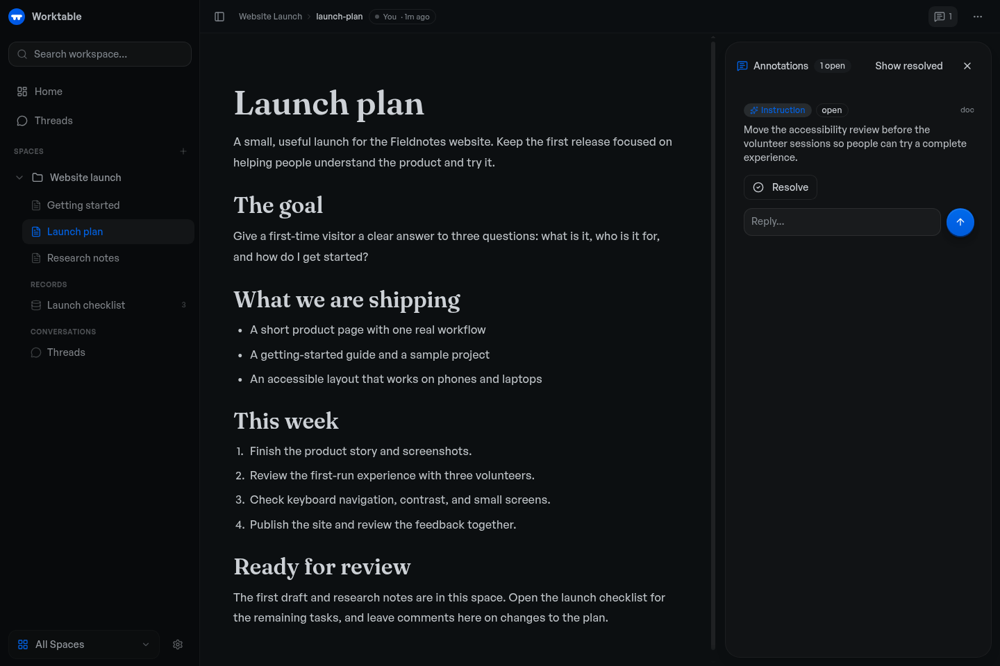

# Worktable

Worktable is an open-source workspace where you and your agents create and
revise documents, drawings, structured records, and interactive tools. Connect
an agent through MCP, then work together in the browser or Desktop app.

Run it locally with files you control, self-host it, or use Worktable Cloud.

[Get started](#get-started) · [Documentation](https://docs.worktable.dev) · [Worktable Cloud](https://www.worktable.cloud) · [Releases](https://github.com/worktable/worktable-dev/releases)



*Example cost explorer backed by saved research and records. The displayed prices
illustrate the tool; they are not current provider quotes.*

## Get started

Use an MCP-compatible agent, with its own subscription or API credentials
where required.

**macOS app:** [Download Worktable for Mac](https://github.com/worktable/worktable-dev/releases/latest/download/worktable-desktop-darwin-arm64.dmg)
for Apple Silicon, macOS 13 or newer. Install and open the app, then choose **This Mac**.

**Terminal:** macOS or Linux, arm64 or x64. No separate runtime or source
checkout needed.

```sh
curl -fsSL https://worktable.dev/install | sh
```

Open the browser address printed by the installer. Run `worktable` to open
it again later.

In either version, open **Settings → Agents** and [connect your agent](https://docs.worktable.dev/agents/connections/).
Ask it to save research, organize records, or build a tool in Worktable.

[Inspect the installer](install.sh) · [Installation guide](https://docs.worktable.dev/start/install/) · [First task](https://docs.worktable.dev/start/first-space/)

**Cloud:** [Worktable Cloud](https://www.worktable.cloud) manages hosting for you.
For other setups, see [self-hosting](https://docs.worktable.dev/guides/remote-access/).

## What to make

- **Save your research.** Keep findings, plans, and decisions in linked documents.
- **Organize your data.** Maintain tasks, sources, feedback, and other records
  with shared fields.
- **Draw a plan.** Sketch a layout, diagram, or visual explanation and revise it
  with an agent.
- **Build interactive tools.** Create a calculator, dashboard, or explorer. Use
  supplied data, or connect the tool to workspace records when needed.

For example, ask an agent to research hosting options, save the sources and
pricing, and build a cost explorer for your expected usage. Recheck the rates
or change the assumptions later; the research, data, and tool stay together.

## Continue your work

Connected agents work with the same saved documents, records, and tools. Ask
another agent to continue from what's already there. You can edit the results
yourself or leave comments for an agent to act on.

## Your data

- **Keep work local.** Local and self-hosted workspaces are backed by files you
  can inspect and back up. Local Worktable requires no account.
- **Move your workspace.** [Export and import](https://docs.worktable.dev/guides/import-export/)
  between Local, self-hosted Worktable, and Cloud.

Connected agent providers may process the content you give them under their own
terms. See [workspace storage](https://docs.worktable.dev/reference/workspace-files/)
for storage and portability details.

## Documentation

[Workflows](https://docs.worktable.dev/workflows/) · [CLI and MCP reference](https://docs.worktable.dev/reference/cli/) · [Changelog](CHANGELOG.md)

[Report a bug](https://github.com/worktable/worktable-dev/issues/new?template=bug_report.yml)
or [ask a question](https://github.com/worktable/worktable-dev/discussions/categories/q-a).
Remove private information from attachments. Report vulnerabilities privately
through the [security policy](SECURITY.md).

## Contributing

Fixes and documentation improvements are welcome. Please discuss substantial
features first. Read [CONTRIBUTING.md](CONTRIBUTING.md) for the contribution process,
[development](docs/development.md) to run from source, or
[building](docs/building.md) to create release artifacts.

## License

The Worktable application is **AGPL-3.0-only**, copyright Reva Labs.
See [LICENSE](LICENSE). Some shared components and agent plugins have MIT
licenses; [NOTICE](NOTICE) and the relevant package notices identify the exact
exceptions and third-party terms.
